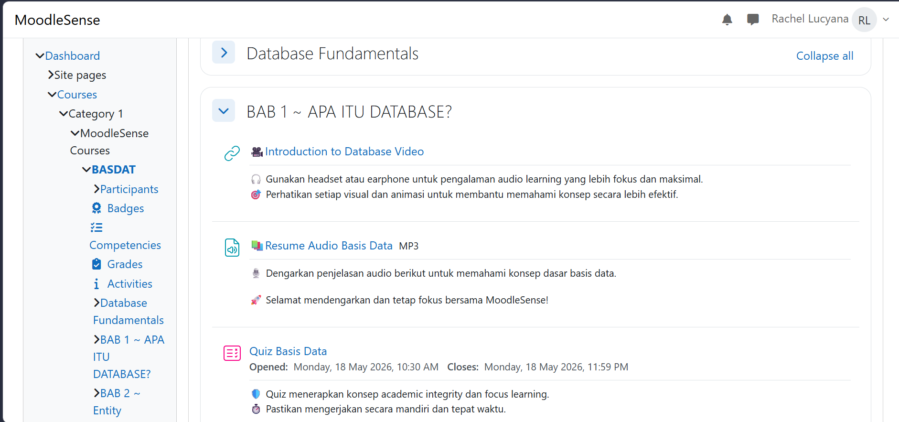
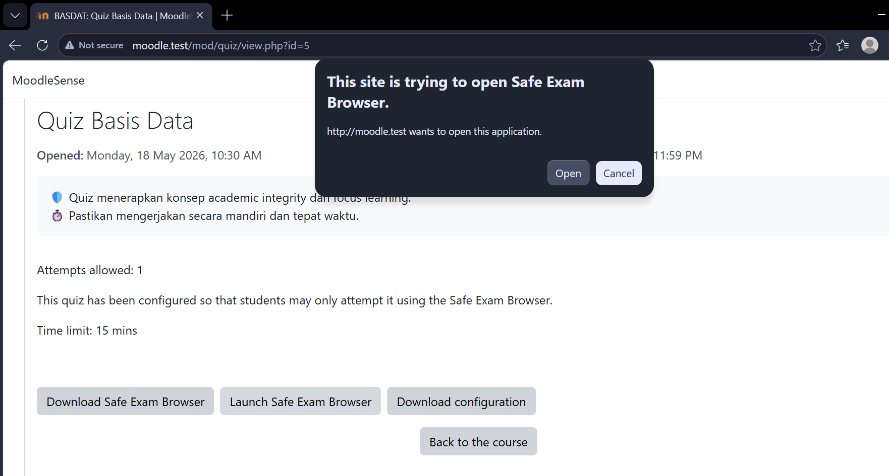
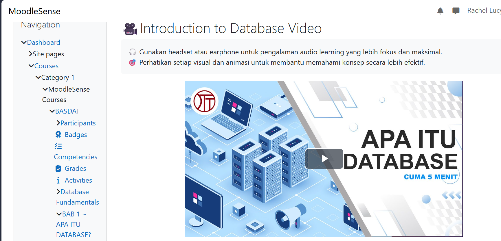

# LMS-Project
Berikut adalah progres pengerjaan **LMS-Project** (Moodle) yang telah diselesaikan oleh kelompok kami:
* **Instalasi & Setup Server:** Moodle berhasil dikonfigurasi pada lingkungan server lokal menggunakan Laragon.
* **Manajemen Pengguna (User Management):** Pengaturan akun dan hak akses (*role*) untuk Admin, Teacher (Dosen), dan Student (Mahasiswa) sudah selesai dikonfigurasi.
* **Struktur LMS & Konten:** Pembuatan materi kuliah (*courses*), forum diskusi, serta fitur evaluasi berupa kuis dan slot penugasan telah siap digunakan.
  
# Features
- Video-based learning
- Audio learning materials
- Moodle Quiz
- Safe Exam Browser (SEB)
- Interactive learning media
  
# Preview
### Course Moodle

### Quiz SEB

### Video Learning

# Theme Moodle 

### Link Repository Utama
Seluruh dokumentasi dan progres pengerjaan proyek LMS ini dapat diakses melalui tautan berikut:
* **Repository GitHub:** [LMS-Project - Moodle Kelompok](https://github.com/lucyanarachel7-cpu/LMS-Project)
